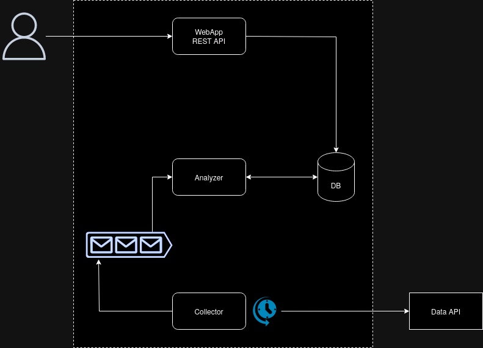
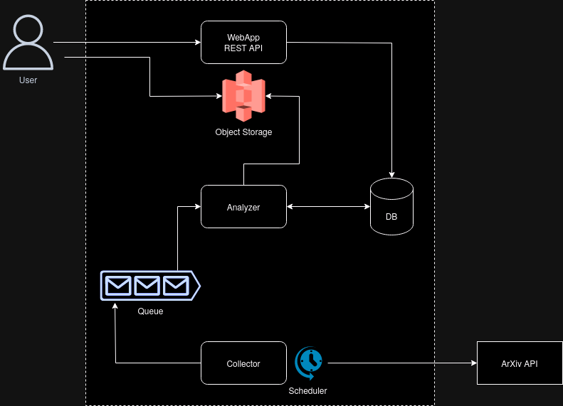

# Architecture

Architecture diagrams and rationale of the services used for the app.

<!-- toc -->

## Whiteboard

Here is a diagram of the planned architecture of the app at the
beginning.

## Final

Diagram of the final architecture of the app.

## Components

### User

The user interacting with the app over the Internet.

### Web app / REST API

The presentation component of the app.
Handles all interactions from the users.
Presents the most recent articles to the user.
Handles requests for older articles through the REST API.

### Database

Durable storage of information about the ingested articles.
Keeps an index of the timestamps of the articles.
Used by the web app to retrieve the most recent articles.

### Data API / ArXiv API

External service.
Used to load data into the app.

### Collector

A job process to load the most recent data from data API.

### Scheduler

Invokes the collector job periodically to load recent data into the
queue.

### Queue

Message queue used to provide loose coupling between the collector and
analyzer jobs.
Collector pushes messages about the new articles available.
Analyzer(s) pull messages from the queue and processes them.

### Analyzer

The main processing service.
Read data from the queue.
Executes text2speech transformation on the data.
Stores data in the datastores: audio in the object storage, metadata in
the database.

### Object Storage

S3-like data storage. Used to store audio files which are too big for
the database.
Users get the audio data directly from the object storage at a URL
generated by the web server.

## Changes

A quick rundown of the changes between the planned and realized
architecture.

### Object Storage

Object storage was added to store audio files.
Has the added benefit of an integrated CDN.
Users can request data files directly from the object storage.
This keeps the work load on the web app to a minimum as all it needs to
do is return URLs to the audio files in the object storage.

